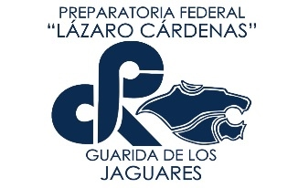

Ejemplo (favor  borrarlo)
#  Rene Solis Reyes # Grupo 1111 #Travis 

# _Nombre_ GRUPO _____  Travis (markdown del Status de su Travis)

Lista de programas.

1.-
1.-
1.-
1.-
1.-
1.-
1.-
1.-

Objetivo de practicar programas sencillos de prepa en Python, para ejercitar con mas confianza para el tema de los _cuadernos de Jupyter_
