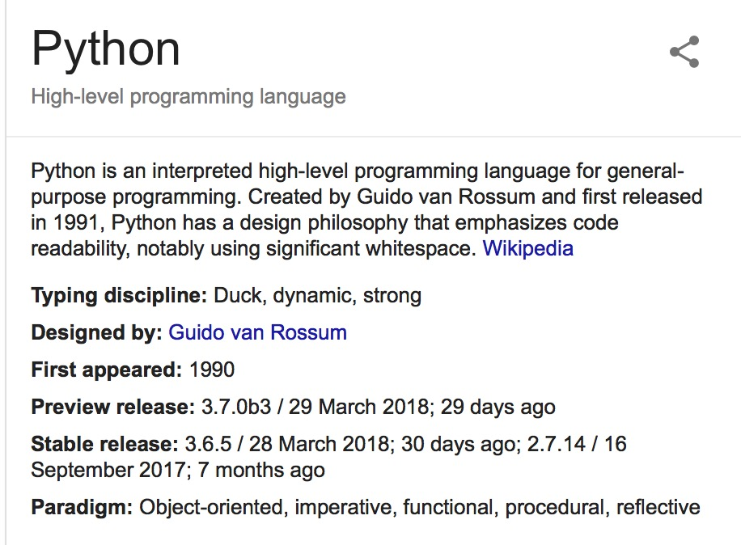

# TEMPLETE FAVOR DE ACONDICIONARLO A LOS OBJETIVOS DE SU PRACTICA (BORRAME)

Ejemplo (favor  borrarlo)
#  Rene Solis Reyes # Grupo 1111 #Travis 

# _Nombre_ GRUPO _____  Travis (markdown del Status de su Travis)

Objetivo de practicar programas sencillos de prepa en Python, para ejercitar con mas confianza para el tema de los _cuadernos de Jupyter_

Lista de programas.

| 1  | practica .... |
|----|---------------|
| 2  |               |
| 3  |               |
| 4  |               |
| 5  |               |
| 6  |               |
| 7  |               |
| 8  |               |
| 9  |               |
| 10 |               |

