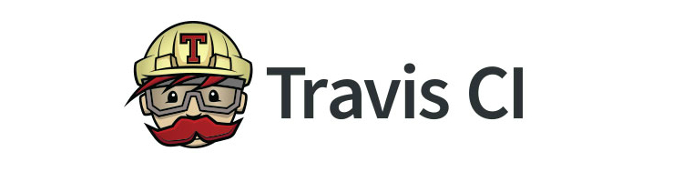

# TEMPLETE FAVOR DE ACONDICIONARLO A LOS OBJETIVOS DE SU PRACTICA (BORRAME)

#  Rene Solis Reyes # Grupo 1111 #Travis 

# _Nombre_ GRUPO _____  Travis (markdown del Status de su Travis)

Objetivo de practicar programas sencillos en Python, para ejercitar con mas confianza para el tema de _cuadernos de Jupyter_

Colocar el emoji de ✅ en la actividad realizada.

[ ] Corregir, los encabezados de este documento para que se refleje la actividad original de su parte.
[ ] Carpeta de IMAGENES subir aquellas que requiera y elazarlas al README.md
[ ] Agregar links (opcionales)
[ ] Subir los programas de python
[ ] Corregir la tabla de practicas
[ ] Corregir el "travis.ylm" agreado Script a cada uno de los programas
[ ] Agregar el Markdown de Travis que muestra esta funcionando en su reporsitorio
[ ] Estabilizar la corrida de los programas, verificando y correccion

| Practica  | Explicación   | Verificado |
|----|---------------|---------------|
| hello.py |   Despliega Hola Mundo  |
| 3  |               |               |
| 4  |               |               |
| 5  |               |               |
| 6  |               |               |
| 7  |               |               |
| 8  |               |               |
| 9  |               |               |
| 10 |               |               |

